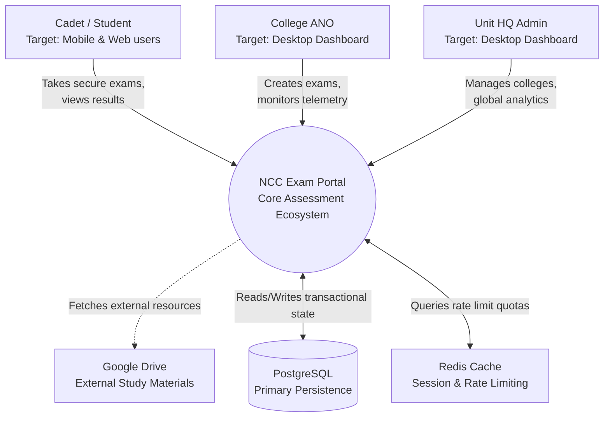
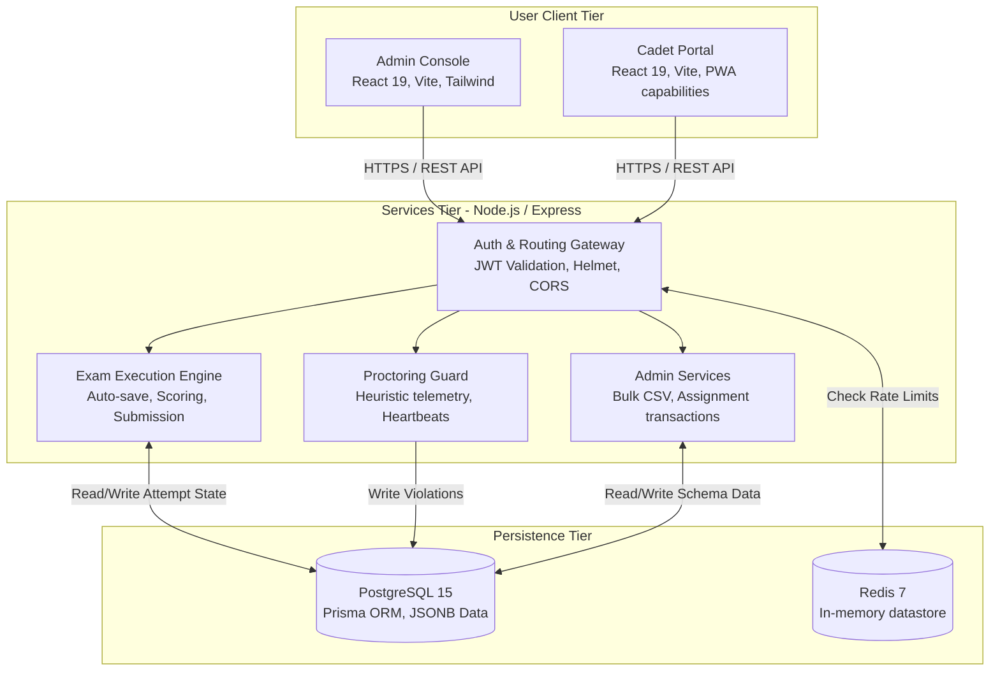
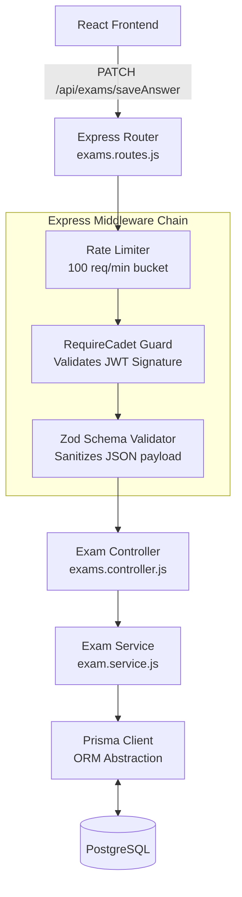

# Chapter 2: C4 Models & System Topology

To provide clarity on how the NCC Exam Portal is structured, we employ the **C4 Model** for visualizing software architecture. This progresses from a high-level system context down to specific component interactions.

## 2.1 Level 1: System Context Diagram

The System Context diagram illustrates the NCC Exam Portal's relationship with its users and external systems.

## 2.2 Level 2: Container Diagram

The Container diagram zooms into the system to show the high-level technical containers that make up the software architecture.

## 2.3 Level 3: Component Diagram (Backend API)

Zooming into the `API Services` container, we map the flow of a critical transactional request: `PATCH /api/exams/saveAnswer`.

### Component Interaction Logic:
1. **Express Router:** Receives the incoming HTTPS request and routes it to the specific middleware chain.
2. **Rate Limiter:** Checks Redis to ensure the IP hasn't exceeded the endpoint-specific threshold.
3. **Auth Guard:** Extracts the HTTP-Only JWT, verifies the cryptographic signature, and asserts that the `role` is `CADET`. Injects `req.user`.
4. **Zod Validator:** Prevents NoSQL/SQL injections by ensuring the body strictly conforms to expected shapes (e.g., `studentId` is an integer, `answer` is a string).
5. **Controller:** Orchestrates the HTTP response (Status Codes) and invokes the business logic service.
6. **Service:** Executes business rules (e.g., checking if the exam hasn't expired) and calls Prisma.
7. **Prisma ORM:** Compiles the query into parameterized SQL to update the `JSONB` answers column safely.
