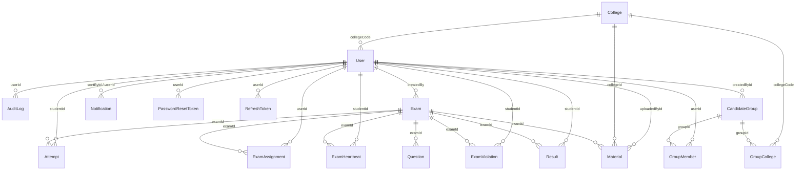

# Data Model & Schema Analysis

## 1.1 Entity Catalogue

### User
| Field | Type | Nullable | Default | Constraints | Notes |
|---|---|---|---|---|---|
| id | Int | No | autoincrement() | @id | Primary Key |
| name | String | No | - | - | - |
| regimentalNumber | String | Yes | - | @unique | - |
| email | String | Yes | - | @unique | - |
| password | String | No | - | - | - |
| role | String | No | - | - | - |
| refreshToken | String | Yes | - | - | - |
| batch | String | Yes | - | - | - |
| isActive | Boolean | No | true | - | Soft delete flag |
| canManageExams | Boolean | No | false | - | - |
| wing | String | Yes | - | - | - |
| mobile | String | Yes | - | - | - |
| yearOfStudy | String | Yes | - | - | - |
| collegeCode | String | Yes | - | FK to College | Tenant ID |

### College
| Field | Type | Nullable | Default | Constraints | Notes |
|---|---|---|---|---|---|
| id | Int | No | autoincrement() | @id | Primary Key |
| name | String | No | - | @unique | - |
| code | String | No | - | @unique | Tenant identifier |
| address | String | Yes | - | - | - |
| city | String | Yes | - | - | - |
| state | String | Yes | - | - | - |
| pincode | String | Yes | - | - | - |
| nccContactName | String | Yes | - | - | - |
| nccContactEmail | String | Yes | - | - | - |
| nccContactPhone | String | Yes | - | - | - |
| isActive | Boolean | No | true | - | Soft delete flag |
| createdAt | DateTime | No | now() | - | - |
| updatedAt | DateTime | No | - | @updatedAt | Prisma managed |

### Batch
| Field | Type | Nullable | Default | Constraints | Notes |
|---|---|---|---|---|---|
| id | Int | No | autoincrement() | @id | Primary Key |
| name | String | No | - | @unique | - |
| isActive | Boolean | No | true | - | Soft delete flag |
| createdAt | DateTime | No | now() | - | - |
| updatedAt | DateTime | No | - | @updatedAt | Prisma managed |

### PasswordResetToken
| Field | Type | Nullable | Default | Constraints | Notes |
|---|---|---|---|---|---|
| id | Int | No | autoincrement() | @id | Primary Key |
| userId | Int | No | - | FK to User | OnDelete Cascade |
| tokenHash | String | No | - | @unique | - |
| expiresAt | DateTime | No | - | - | - |
| usedAt | DateTime | Yes | - | - | - |
| createdAt | DateTime | No | now() | - | - |

### Material
| Field | Type | Nullable | Default | Constraints | Notes |
|---|---|---|---|---|---|
| id | Int | No | autoincrement() | @id | Primary Key |
| title | String | Yes | - | - | - |
| category | String | Yes | - | - | - |
| fileUrl | String | Yes | - | - | - |
| examId | Int | Yes | - | FK to Exam | - |
| createdAt | DateTime | No | now() | - | - |
| mimeType | String | Yes | - | - | - |
| originalName | String | Yes | - | - | - |
| sizeBytes | Int | Yes | - | - | - |
| storedName | String | Yes | - | @unique | - |
| uploadedById | Int | No | - | FK to User | - |
| accessStatus | AccessStatus | No | VERIFIED | Enum | - |
| collegeId | Int | Yes | - | FK to College | Tenant ID |
| description | String | Yes | - | - | - |
| driveFileId | String | Yes | - | - | - |
| fileType | FileType | Yes | - | Enum | - |
| isActive | Boolean | No | true | - | Soft delete flag |
| subject | String | Yes | - | - | - |
| updatedAt | DateTime | No | - | @updatedAt | Prisma managed |
| wing | String | Yes | - | - | - |

### Exam
| Field | Type | Nullable | Default | Constraints | Notes |
|---|---|---|---|---|---|
| id | Int | No | autoincrement() | @id | Primary Key |
| title | String | No | - | - | - |
| duration | Int | No | - | - | - |
| startAt | DateTime | Yes | - | - | - |
| endAt | DateTime | Yes | - | - | - |
| createdBy | Int | No | - | FK to User | - |
| createdAt | DateTime | No | now() | - | - |
| status | String | No | "DRAFT" | - | - |
| publishedAt | DateTime | Yes | - | - | - |
| resultsPublished| Boolean | No | false | - | - |
| negativeMarking| Boolean | No | false | - | - |
| positiveMarks | Int | No | 4 | - | - |
| negativeMarks | Float | No | 1.0 | - | - |

### ExamAssignment
| Field | Type | Nullable | Default | Constraints | Notes |
|---|---|---|---|---|---|
| id | Int | No | autoincrement() | @id | Primary Key |
| userId | Int | No | - | FK to User | OnDelete Cascade |
| examId | Int | No | - | FK to Exam | OnDelete Cascade |
| createdAt | DateTime | No | now() | - | Unique [userId, examId] |

### Question
| Field | Type | Nullable | Default | Constraints | Notes |
|---|---|---|---|---|---|
| id | Int | No | autoincrement() | @id | Primary Key |
| examId | Int | No | - | FK to Exam | OnDelete Cascade |
| question | String | No | - | - | - |
| options | String[] | No | - | - | - |
| answer | String | No | - | - | - |
| type | String | No | "MCQ" | - | - |
| topic | String | Yes | - | - | - |
| marks | Int | No | 4 | - | - |

### Attempt
| Field | Type | Nullable | Default | Constraints | Notes |
|---|---|---|---|---|---|
| id | Int | No | autoincrement() | @id | Primary Key |
| studentId | Int | No | - | FK to User | OnDelete Cascade |
| examId | Int | No | - | FK to Exam | OnDelete Cascade |
| status | String | No | - | - | - |
| createdAt | DateTime | No | now() | - | - |
| answers | Json | Yes | "{}" | - | - |
| startedAt | DateTime | No | now() | - | - |
| expiresAt | DateTime | Yes | - | - | - |
| lastSavedAt | DateTime | Yes | - | - | - |
| sessionId | String | Yes | - | - | - |
| warningCount | Int | No | 0 | - | - |
| currentQuestionIndex| Int | No | 0 | - | - |
| updatedAt | DateTime | No | - | @updatedAt | Prisma managed |

*(Note: Unique constraint on [studentId, examId])*

### Result
| Field | Type | Nullable | Default | Constraints | Notes |
|---|---|---|---|---|---|
| id | Int | No | autoincrement() | @id | Primary Key |
| studentId | Int | No | - | FK to User | OnDelete Cascade |
| examId | Int | No | - | FK to Exam | OnDelete Cascade |
| score | Int | No | - | - | - |
| rawScore | Int | Yes | - | - | - |
| maxScore | Int | Yes | - | - | - |
| timeTaken | Int | Yes | - | - | - |
| createdAt | DateTime | No | now() | - | Unique [studentId, examId] |

### ExamViolation
| Field | Type | Nullable | Default | Constraints | Notes |
|---|---|---|---|---|---|
| id | Int | No | autoincrement() | @id | Primary Key |
| studentId | Int | No | - | FK to User | OnDelete Cascade |
| examId | Int | No | - | FK to Exam | OnDelete Cascade |
| type | String | No | - | - | - |
| message | String | Yes | - | - | - |
| createdAt | DateTime | No | now() | - | - |

### ExamHeartbeat
| Field | Type | Nullable | Default | Constraints | Notes |
|---|---|---|---|---|---|
| id | Int | No | autoincrement() | @id | Primary Key |
| studentId | Int | No | - | FK to User | OnDelete Cascade |
| examId | Int | No | - | FK to Exam | OnDelete Cascade |
| activeQuestionIndex| Int | Yes | - | - | - |
| lastSeenAt | DateTime | No | - | @updatedAt | Prisma managed |
| createdAt | DateTime | No | now() | - | Unique [studentId, examId] |

### Notification
| Field | Type | Nullable | Default | Constraints | Notes |
|---|---|---|---|---|---|
| id | Int | No | autoincrement() | @id | Primary Key |
| message | String | No | - | - | - |
| userId | Int | Yes | - | FK to User | NotificationRecipient |
| sentById | Int | No | - | FK to User | NotificationSender |
| createdAt | DateTime | No | now() | - | - |

### AuditLog
| Field | Type | Nullable | Default | Constraints | Notes |
|---|---|---|---|---|---|
| id | Int | No | autoincrement() | @id | Primary Key |
| userId | Int | Yes | - | FK to User | - |
| action | String | No | - | - | - |
| entityType | String | Yes | - | - | - |
| entityId | String | Yes | - | - | - |
| method | String | No | - | - | - |
| path | String | No | - | - | - |
| statusCode | Int | No | - | - | - |
| ip | String | Yes | - | - | - |
| userAgent | String | Yes | - | - | - |
| requestId | String | Yes | - | - | - |
| metadata | Json | Yes | - | - | - |
| createdAt | DateTime | No | now() | - | - |

### RefreshToken
| Field | Type | Nullable | Default | Constraints | Notes |
|---|---|---|---|---|---|
| id | Int | No | autoincrement() | @id | Primary Key |
| userId | Int | No | - | FK to User | OnDelete Cascade |
| tokenHash | String | No | - | @unique | - |
| expiresAt | DateTime | No | - | - | - |
| revokedAt | DateTime | Yes | - | - | - |
| createdAt | DateTime | No | now() | - | - |

### CandidateGroup
| Field | Type | Nullable | Default | Constraints | Notes |
|---|---|---|---|---|---|
| id | Int | No | autoincrement() | @id | Primary Key |
| name | String | No | - | @unique | - |
| description | String | Yes | - | - | - |
| isActive | Boolean | No | true | - | Soft delete flag |
| createdById | Int | No | - | FK to User | GroupCreator |
| createdAt | DateTime | No | now() | - | - |
| updatedAt | DateTime | No | - | @updatedAt | Prisma managed |

### GroupMember
| Field | Type | Nullable | Default | Constraints | Notes |
|---|---|---|---|---|---|
| id | Int | No | autoincrement() | @id | Primary Key |
| groupId | Int | No | - | FK to CandidateGrp| OnDelete Cascade |
| userId | Int | No | - | FK to User | OnDelete Cascade |
| createdAt | DateTime | No | now() | - | Unique [groupId, userId] |

### GroupCollege
| Field | Type | Nullable | Default | Constraints | Notes |
|---|---|---|---|---|---|
| id | Int | No | autoincrement() | @id | Primary Key |
| groupId | Int | No | - | FK to CandidateGrp| OnDelete Cascade |
| collegeCode | String | No | - | FK to College | OnDelete Cascade |
| createdAt | DateTime | No | now() | - | Unique [groupId, code] |

## 1.2 Relationship Map

### 1-to-Many Relationships
- `User` ──< `Attempt` via field `studentId`
- `User` ──< `AuditLog` via field `userId`
- `User` ──< `Exam` via field `createdBy`
- `User` ──< `ExamAssignment` via field `userId`
- `User` ──< `ExamHeartbeat` via field `studentId`
- `User` ──< `ExamViolation` via field `studentId`
- `User` ──< `Material` via field `uploadedById`
- `User` ──< `Notification` via field `sentById`
- `User` ──< `Notification` via field `userId`
- `User` ──< `PasswordResetToken` via field `userId`
- `User` ──< `RefreshToken` via field `userId`
- `User` ──< `Result` via field `studentId`
- `User` ──< `CandidateGroup` via field `createdById`
- `User` ──< `GroupMember` via field `userId`
- `College` ──< `User` via field `collegeCode`
- `College` ──< `Material` via field `collegeId`
- `College` ──< `GroupCollege` via field `collegeCode`
- `Exam` ──< `Attempt` via field `examId`
- `Exam` ──< `ExamAssignment` via field `examId`
- `Exam` ──< `ExamHeartbeat` via field `examId`
- `Exam` ──< `ExamViolation` via field `examId`
- `Exam` ──< `Material` via field `examId`
- `Exam` ──< `Question` via field `examId`
- `Exam` ──< `Result` via field `examId`
- `CandidateGroup` ──< `GroupMember` via field `groupId`
- `CandidateGroup` ──< `GroupCollege` via field `groupId`

### Mermaid Diagram

## 1.3 Enum Catalogue

- **`FileType`**
  - **Values**: `PDF`, `VIDEO`, `DOCUMENT`
  - **Usage**: Used in `Material` model, field `fileType`.
- **`AccessStatus`**
  - **Values**: `VERIFIED`, `RESTRICTED`, `PENDING`, `ERROR`
  - **Usage**: Used in `Material` model, field `accessStatus` (default: `VERIFIED`).

## 1.4 Tenant Isolation

Multi-tenancy in this application is **not** enforced automatically via Prisma Middlewares or Extensions (e.g. `$use` or `$extends` for RLS).

Instead, it is enforced **manually in the backend service layer via raw WHERE clauses**. 
- The tenant identifiers are:
  - `collegeCode` (String) on the `User` and `GroupCollege` models.
  - `collegeId` (Int) on the `Material` model.

**Exact Code Location Example**:
In `backend/src/services/users.service.js` (lines 165-170):
\`\`\`javascript
if (currentUser.collegeCode) {
  where.collegeCode = currentUser.collegeCode;
}
if (instructorRecord?.collegeCode) {
  where.collegeCode = instructorRecord.collegeCode;
}
\`\`\`
This shows that tenant isolation heavily relies on developers actively remembering to inject the `collegeCode` restriction into Prisma query objects based on `req.user`.

## 1.5 Soft Delete & Audit Fields

- **Managed by Prisma (`@updatedAt`)**:
  - `College` (updatedAt)
  - `Batch` (updatedAt)
  - `Material` (updatedAt)
  - `Attempt` (updatedAt)
  - `ExamHeartbeat` (lastSeenAt)
  - `CandidateGroup` (updatedAt)
  
- **Manual System Timestamps**:
  - `createdAt` is explicitly defined across almost all models with `@default(now())`. 

- **Soft Delete Flags**:
  - The application manages soft deletes via boolean flags instead of a `deletedAt` timestamp:
  - `isActive` on `User`
  - `isActive` on `College`
  - `isActive` on `Batch`
  - `isActive` on `Material`
  - `isActive` on `CandidateGroup`

*(No `deletedAt` fields are present in the schema).*

## 1.6 Migration History

Migrations in chronological order:

1. `20260401152624_init/migration.sql`
2. `20260401160000_user_login_fields/migration.sql`
   - *Destructive Note:* Drops `NOT NULL` constraint from `User.regimentalNumber` (`ALTER TABLE "User" ALTER COLUMN "regimentalNumber" DROP NOT NULL;`).
3. `20260401180000_exam_relations_and_unique_attempts/migration.sql`
   - *Destructive Note:* Drops foreign key constraint (`ALTER TABLE "Question" DROP CONSTRAINT IF EXISTS "Question_examId_fkey";`).
4. `20260404120000_materials/migration.sql`
5. `20260405120000_user_cadet_profile/migration.sql`
6. `20260417111533_password_reset_tokens/migration.sql`
   - *Destructive Note:* Drops `NOT NULL` constraint from `User.mobile` (`ALTER TABLE "User" ALTER COLUMN "mobile" DROP NOT NULL;`).
7. `20260423081157_attempt_transaction_progress/migration.sql`
8. `20260423143000_phase2_anti_cheat_notifications/migration.sql`
9. `20260423152000_exam_publish_lifecycle/migration.sql`
10. `20260423161000_audit_logs_and_security/migration.sql`
11. `20260423170000_refresh_token_rotation/migration.sql`
12. `20260423182000_admin_allowed_students/migration.sql`
13. `20260424130257_add_eligibility_and_refresh/migration.sql`
14. `20260424164721_add_user_classification/migration.sql`
15. `20260424165021_add_exam_status/migration.sql`
16. `20260424201349_add_attempt_tracking/migration.sql`
17. `20260708150400_perf_indexes/migration.sql`

*Overall, no migrations physically dropped structural columns (`DROP COLUMN`); they only dropped NOT NULL constraints or re-created foreign keys.*
